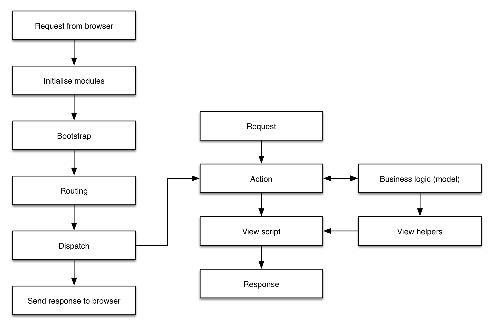

# A quick tour of the skeleton application
========================================

The skeleton application provides a lot of files, so it's worth having a quick
high-level look at what has been generated for us. There are a number of high
level directories created for us (along with [Composer](http://getcomposer.org)
and other support files):

Folder   | Information stored
-------- | ------------------
`config` | Application-level configuration files.
`data`   | Data files generated by the application, such as caches.
`module` | The source files that make up this application are stored within separate modules within this folder.
`public` | The web server's document root. All files served directly by the web server are in here.
`vendor` | Third party libraries.

One of the key features of Zend Framework 2 is its module system. This provides
organisation within your application; all application code lives within a
module. The skeleton provides the `Application` module for bootstrapping, error
and routing configuration. It also provides the application-level controllers
for the home page and error display. The `Application` module contains these key
folders:

Folder             | Information stored
------------------ | ------------------
`config`           | Module-specific configuration files.
`src/Application`  | PHP files for this module, including controller and model files. The controller for the home page, `IndexController.php`, is provided.
`view/application` | View scripts for each controller action.
`view/error`       | Error view scripts for 404 and generic errors.
`view/layout`      | Layout view scripts. These contain the common HTML shared by a number of pages within the website. An initial default file, `layout.phtml`, is provided.

Modules are simply namespaces containing a top level `Module` class. They are
intended to be reusable and no additional constraints are placed on how they are
organised. An application consists of multiple modules, both third party and
application specific, with the list of modules to load stored in
`config/application.config.php`.

## The dispatch cycle

Zend Framework 2 applications use the [Front Controller](http://www.martinfowler.com/eaaCatalog/frontController.html)
design pattern. This means that all requests are directed to a single entry
point, the `public/index.php` file. This is done using a `.htaccess` file
containing rewrite rules that serves all static files (such as CSS &amp;
JavaScript) and directs all other requests to the `index.php`. The `index.php` file
initialises the autoloader and then bootstraps `Zend\Mvc\Application` before
finally running the application. The process looks like this:

### Starting up

To set up the application for running, a number of things happen. Firstly an
instance of `Zend\ServiceManager\ServiceManager` is created as the master
locator for all class instances used by the application. The Module Manager is
then used to load all the application's modules. It does this by reading its
configuration file, `application.config.php`, which is solely for use by the
Module Manager and does not contain the configuration used by the application
itself.

The modules are loaded in the order listed in the configuration file and for
each module a number of steps takes place:

- Configuration of autoloading.
- Loading of module configuration.
- Registration of event listeners.
- Configuration of the Service Manager.

The configuration information from all modules is merged together into one
configuration array. This means that configuration information in subsequent
modules can override information already set. Finally, the global configuration
files stored in the `config/autoload` directory are merged (the `*.global.php`
and then the `*.local.php` files). This means that any module's configuration
can be overridden at the application level and is a key feature that helps to
ensure that the code within a third-party module does not need to be changed.

The Service Manager and Event Manager are two other key features of a Zend
Framework 2 application.  [zend-servicemanager](https://zendframework.github.io/zend-servicemanager/)
allows for decoupling the instantiation and configuration of a class and its
dependencies from where that class is used. This is known as Dependency
Injection and is used extensively in Zend Framework 2.
[zend-eventmanager](https://zendframework.github.io/zend-eventmanager/)
is an implementation of the Observer design pattern which allows decoupling of
code. In Zend Framework 2, every key process in the dispatch cycle is
implemented as an event. This means that you can write listeners for these
events which can then change the flow of operation or perform additional
processes when something else has happened.

### Dispatching

Once all modules have been loaded, the application is run. This is done as a
series of events, with the first event, `route`, used to determine the
controller action that should be run based on the URL requested. Once this is
determined, the `dispatch` event is triggered which causes the action method
within the controller class to be executed. The view rendering event, `render`,
is then triggered if an HTML view is required. Finally the `finish` event is
triggered which sends the response back to the user's web browser.

While this is a typical dispatch cycle, Zend Framework 2's dispatch system is
very flexible and can be configured in a variety of ways depending on the
specific application. Now that we've looked at how Zend Framework works, let's
move on and write the *MyTaskList* application.
